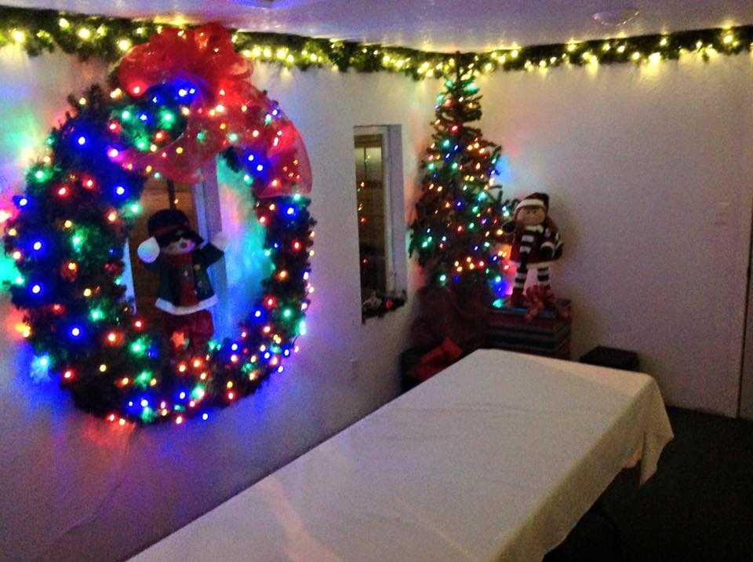
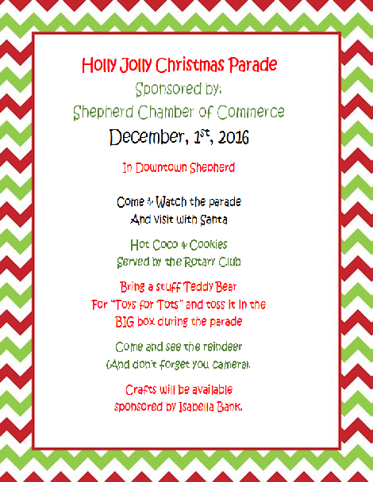
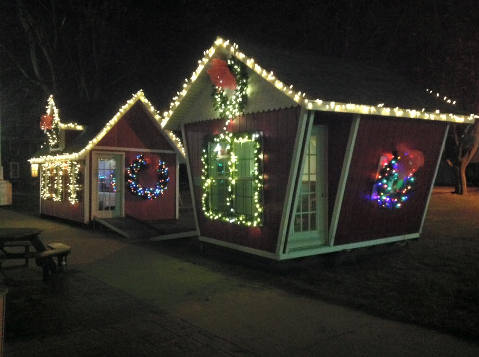

Santa is coming to the Village of Shepherd!

Thursday December first, Santa will be leading a Christmas parade down town Shepherd at 6:00pm. He will be holding hours in the warm Santa house in the Village park across from the Shepherd Bar &amp; Restaurant to receive Christmas wants and list from everyone young and old.

After Santa gets the low down of what you want for Christmas, stop at the neighboring elf house for a cookie and hot chocolate.

| [wpghs target='view' type='link' text='Here is my post on GitHub'] |
